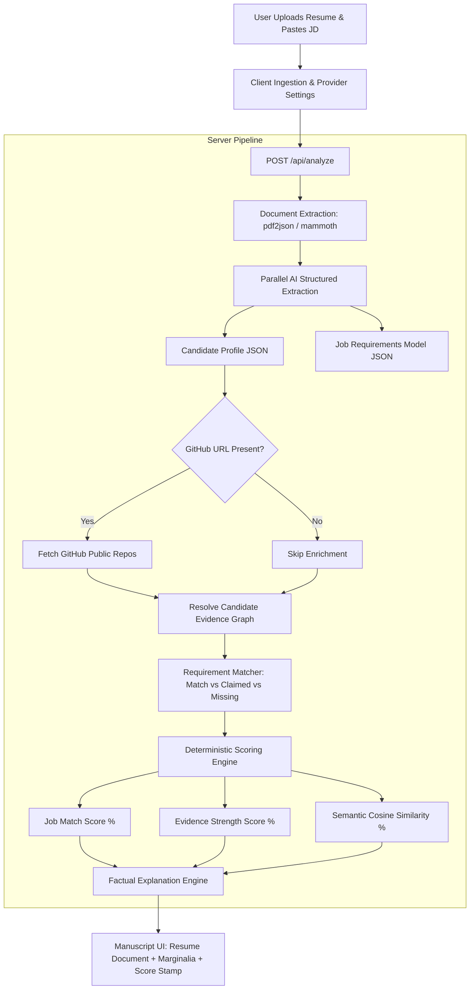

# <p align="center"><br>Resurox — AI Resume & Job Fit Analyzer</p>

<p align="center">
  <strong>EDIT • ANALYZE • ADVANCE</strong><br>
  <em>Evidence-Backed Manuscript Resume Analysis & Deterministic Scoring Engine</em>
</p>

<p align="center">
  
  
  
  
  
</p>

---

## 📌 Table of Contents

- [Overview & Broad Use Cases](#-overview--broad-use-cases)
- [Key Features & Capabilities](#-key-features--capabilities)
- [Architecture & Working Mechanism](#-architecture--working-mechanism)
- [End-to-End Evaluation Pipeline Graph](#-end-to-end-evaluation-pipeline-graph)
- [Visual Proofs & Workflow Screenshots](#-visual-proofs--workflow-screenshots)
- [Getting Started & Local Setup](#-getting-started--local-setup)
- [Where to Get API Keys (Step-by-Step)](#-where-to-get-api-keys-step-by-step)
- [Deterministic Scoring Methodology](#-deterministic-scoring-methodology)
- [Pages & Site Structure](#-pages--site-structure)
- [Contact & Support](#-contact--support)
- [Contribution Guide](#-contribution-guide)
- [Quality Assurance & Pre-Push Verification](#-quality-assurance--pre-push-verification)
- [Maintainers & Credits](#-maintainers--credits)

---

## 🌟 Overview & Broad Use Cases

**Resurox** is a modern, privacy-first web application engineered to eliminate subjective black-box AI score bias. Traditional AI resume scanners hallucinate scores and provide vague feedback. **Resurox separates structured parsing from mathematical scoring**, executing 100% pure deterministic algorithms over candidate evidence and job requirements.

### Broad Use Cases

1. **For Job Seekers & Candidates**:
   - Audit resumes against specific job descriptions before submitting applications.
   - Detect **"Claimed Only"** skills (skills listed in a bulleted skills section that lack corresponding work experience or project evidence).
   - Receive actionable manuscript revisions and recruiter verdict recommendations without hallucinated feedback.

2. **For Recruiters & Talent Acquisition Teams**:
   - Standardize candidate qualification scoring across resumes with zero prompt-drift or subjective evaluation bias.
   - Automatically cross-reference public GitHub profiles for verified open-source repository evidence.
   - Review transparent multi-dimensional score breakdowns (Job Match, Evidence Strength, Resume Quality, and ATS Compatibility).

3. **For Career Coaches & Universities**:
   - Provide students and mentees with transparent scoring stamps, marginalia notes, and clear guidance on quantifying accomplishments.

---

## 🚀 Key Features & Capabilities

- **Multi-Provider AI Intelligence**: Engineered with a **provider-agnostic architecture** (configured with Groq Cloud, local mock providers, and expandable to any OpenAI-compatible or Google Gemini model).
- **Server-Side Document Text Extraction**: High-fidelity parsing of `.pdf` (via `pdf2json`) and `.docx` (via `mammoth`) documents with strict 5MB limits.
- **Joint Vocabulary Term Frequency Cosine Similarity**: Mathematical vector similarity matching between resume content and job requirements.
- **GitHub Public Profile Enrichment**: Optional real-time enrichment resolving public candidate repositories, primary languages, and star metrics.
- **Evidence-Based Matching Engine**: Classifies every job requirement into `MATCHED`, `CLAIMED_ONLY`, or `MISSING`.
- **Editorial Manuscript UI**: High-contrast, typography-first manuscript layout featuring inline keyword underlines, bracketed margin notes, and a double-strike physical score stamp.
- **Dynamic SEO & Sitemap**: Built-in dynamic sitemap generation at `/sitemap.xml` and robots metadata.

---

## 🏗️ Architecture & Working Mechanism

```
┌─────────────────────────────────────────────────────────────────────────────┐
│                              Resurox ARCHITECTURE                            │
├─────────────────────────────────────────────────────────────────────────────┤
│ 1. Ingestion Layer      : app/page.tsx & FileUpload.tsx                     │
│ 2. API Validation Layer : app/api/analyze/route.ts (5MB max, PDF/DOCX)      │
│ 3. Text Extraction      : lib/extractor.ts (pdf2json / mammoth)             │
│ 4. Structured Parsing   : lib/ai/resumeParser.ts & lib/ai/jobParser.ts      │
│ 5. Evidence Resolution  : lib/evidence/resolver.ts & lib/enrichment/github  │
│ 6. Pure Scoring Engine  : lib/scoring/rubric.ts & lib/scorer.ts             │
│ 7. Factual Explanation  : lib/ai/explanation.ts                             │
│ 8. Manuscript Rendering : components/ResumeDocument.tsx & ScoreStamp.tsx    │
└─────────────────────────────────────────────────────────────────────────────┘
```

1. **File Ingestion & Validation**: Validates file integrity, extension, size, and non-empty job descriptions.
2. **Text Extraction**: Extracts raw document text securely in the server environment.
3. **Parallel LLM Parsing**: Dispatches asynchronous requests to structure raw resume and job description text into strict JSON models.
4. **Evidence Collection & Graph Resolution**: Builds an evidence inventory mapping skills to resume bullet points and public GitHub repositories.
5. **Deterministic Rubric Scoring**: Computes mathematical subscores (Skills Match, Experience Alignment, Education Tier, and Semantic Cosine Similarity).
6. **Factual Feedback Layer**: LLM consumes **pre-calculated** scores and evidence to generate verified strengths and critical gap summaries.

---

## 📊 End-to-End Evaluation Pipeline Graph



---

## 📸 Visual Proofs & Workflow Screenshots

### 1. Landing Screen & Multi-Provider Settings
*Configure your preferred AI provider (OpenRouter, Gemini, OpenAI) and model directly in your browser with secure localStorage caching.*


---

### 2. Document Upload & Job Description
*Drag and drop your PDF/DOCX resume (up to 5MB) and paste the target job description.*


---

### 3. 11-Stage Staged Pipeline Evaluation
*Live multi-stage execution progress bar with real-time evidence evaluation stages.*


---

### 4. Comprehensive Manuscript Evaluation Report
*Interactive manuscript view featuring multi-dimensional score breakdown, recruiter executive verdict, inline underlines, missing skill margin notes, and double-strike match stamp.*


---

## ⚡ Getting Started & Local Setup

### Prerequisites
- **Node.js**: `v20.x` or higher
- **npm** or **pnpm**
- **Git**

### 1. Clone the Repository
```bash
git clone https://github.com/Srijal-io/Resurox.git
cd Resurox
```

### 2. Install Dependencies
```bash
npm install
```

### 3. Configure Environment Variables
Create a `.env.local` file in the project root:
```bash
cp .env.example .env.local
```

Populate your `.env.local` with one or more provider keys:
```env
# Base Application URL
NEXT_PUBLIC_APP_URL=http://localhost:3000

# Server-Side Provider Credentials & Selection
AI_PROVIDER_ORDER=groq-free
GROQ_API_KEY=your_groq_api_key_here
```

### 4. Start Development Server
```bash
npm run dev
```
Open **[http://localhost:3000](http://localhost:3000)** in your browser.

---

## 🔑 Where to Get API Keys (Step-by-Step)

Resurox supports multiple AI providers. You only need **one** active key from any of the following providers:

### Option A: OpenRouter (Recommended / Free Models Available)
1. Navigate to **[OpenRouter.ai](https://openrouter.ai/)**.
2. Sign in with GitHub, Google, or your email.
3. Go to **[Keys Settings](https://openrouter.ai/keys)**.
4. Click **Create Key**, assign a name (e.g., `Resurox-Dev`), and copy the generated key (starts with `sk-or-v1-...`).
5. *Tip*: OpenRouter offers zero-cost access to models with `:free` suffixes (such as `nvidia/nemotron-3-nano-30b-a3b:free` or `meta-llama/llama-3.3-70b-instruct:free`).

### Option B: Google Gemini API
1. Navigate to **[Google AI Studio](https://aistudio.google.com/)**.
2. Sign in with your Google account.
3. Click **Get API key** in the top navigation or sidebar.
4. Click **Create API key in new project** and copy your key.
5. Paste it as `GEMINI_API_KEY` in `.env.local` or enter it directly in the UI settings.

### Option C: OpenAI API
1. Navigate to the **[OpenAI API Platform](https://platform.openai.com/api-keys)**.
2. Sign in or create an OpenAI account.
3. Select **API Keys** from the dashboard menu.
4. Click **Create new secret key**, name it, and copy the key (starts with `sk-...`).

---

## 📐 Deterministic Scoring Methodology

The evaluation engine computes scores mathematically using pre-defined rubrics to guarantee deterministic outputs:

$$\text{Overall Score} = (S \times 0.40) + (E \times 0.25) + (\text{Edu} \times 0.15) + (\text{Sim} \times 0.20)$$

| Component | Weight | Metric Calculation |
| :--- | :---: | :--- |
| **Skills Match ($S$)** | **40%** | $\frac{\text{Matched Skills} + (0.5 \times \text{Partial Skills})}{\text{Total Required Skills}} \times 100$ |
| **Experience Match ($E$)** | **25%** | $\min\left(100, \frac{\text{Candidate Experience Years}}{\text{Required Years}} \times 100\right)$ |
| **Education Alignment ($\text{Edu}$)** | **15%** | Degree Tier comparison (Doctorate: 100%, Master's: 90%, Bachelor's: 80%, Associate: 60%) |
| **Semantic Similarity ($\text{Sim}$)** | **20%** | Cosine similarity across joint term-frequency vocabulary vectors: $\frac{\mathbf{A} \cdot \mathbf{B}}{\|\mathbf{A}\| \|\mathbf{B}\|}$ |

---

## 🗺️ Pages & Site Structure

| Route | Description |
| :--- | :--- |
| `/` | Interactive landing page with feature deep dives, FAQs, and sample evaluations |
| `/app` | Live analysis workbench with resume upload, JD input, and manuscript viewer |
| `/contact` | Direct inquiries desk with subject routing, team details, and dispatch form |
| `/privacy` | Privacy policy detailing client-side storage and ephemeral server parsing |
| `/terms` | Terms of service and open-source usage policies |
| `/sitemap.xml` | Dynamic XML sitemap for search engine discovery |
| `/robots.txt` | Crawler access rules and sitemap indexing directives |

---

## 📬 Contact & Support

For technical inquiries, bug reports, feature suggestions, and open-source collaboration:

- **Email**: [subrato213432@gmail.com](mailto:subrato213432@gmail.com)
- **Contact Desk**: Visit [`/contact`](https://resurox.app/contact) in the web application.
- **Location**: Jharkhand, India

---

## 🤝 Contribution Guide

We welcome contributions! Please adhere to the following workflow:

### 1. Create a Feature Branch
```bash
git checkout -b feat/your-feature-name
# or
git checkout -b fix/your-bugfix-name
```

### 2. Branch Naming Conventions
- `feat/*`: New features or capabilities
- `fix/*`: Bug fixes and error resolutions
- `chore/*`: Documentation, dependencies, or maintenance
- `refactor/*`: Code refactoring without behavior change

### 3. Commit Guidelines
Use [Conventional Commits](https://www.conventionalcommits.org/):
```bash
git commit -m "feat(scoring): add multi-tier certification matching"
git commit -m "fix(extractor): handle corrupt pdf stream error"
```

---

## 🛡️ Quality Assurance & Pre-Push Verification

All commits and Pull Requests are automatically verified by Husky pre-push hooks and GitHub Actions CI (`.github/workflows/ci.yml`).

Before pushing, ensure all 4 automated checks pass locally:

```bash
# 1. Typecheck
npm run typecheck

# 2. ESLint
npm run lint

# 3. Unit & Regression Tests
npm test

# 4. Production Build Verification
npm run build
```

---

## 👥 Maintainers & Credits

Built and maintained with pride by:

- **[CodeItAlone](https://github.com/CodeItAlone)**
- **[Srijal-io](https://github.com/Srijal-io)**

GitHub Repository: **[https://github.com/Srijal-io/Resurox](https://github.com/Srijal-io/Resurox)**

---

## 📄 License

This project is licensed under the [MIT License](LICENSE).


